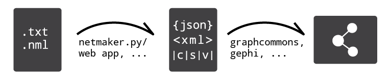

# NetMaker

NetMaker is a project to develop tools and service that convert NetML files to a variety of file formats that can easily be imported by network visualization and analysis software.



NB: NetML is a network markup language which makes it easy to write down information as nodes with properties and links in a simple text file. Read more at https://repmax.github.io/netml/.

## Status

The NetMaker python package has been developed to convert NetML files to json and cvs formats. It performs and detailed check of the NetML file to catch erroneous markup and can make use of a configuation file to expand abbreviated annotation.

## Future development

First priority is to develop javascript based NetMaker web app, so there will be no need for installing and running the python package.

## Instructions for NetMaker python package

1. Download files in root folder
2. Run:
```
from netmaker import *

dict_net = nml2json('input/sample_netml.txt','config_netml.yaml','sample.json')    
df_nodes, df_edges = json2csv(dict_net, 'sample_nodes.csv','sample_edges.csv','config_enrich.yaml')
```

## Release notes for NetMaker v0.1

```
"""
===============================================
netmaker python package v0.1
python 3.5
_______________________________________________
NML2JSON()
dict_net = nml2json(netmlFile, configFile=None, writeJson=None)

Features:
- Returns a python dictionary from a NetML file
- Optionally save python dictionary as a json file.
- If NetML file contains errors, the function will print error information to console and continue checking rest of file for errors. No object is return if source nodes are erronerous. Missing target nodes for edges are printed to console and discarded.
- Referenced nodes can be declared both before and after being referenced.

Parameters:
- netmlFile: A NetML file with network information. Can be any text format: txt/md/nml.
- configFile: An optional YAML file to convert abbreviations to full words. See provided template config file. E.g. 'tw' property can be converted to 'twitter_handle'.
- writeJson: False/True
_______________________________________________
JSON2CSV()
df_nodes, df_edges = json2csv(dictObj, csvNodes=None, csvEdges=None, configFile=None):
    
Features:
- Returns two dataframes (nodes, edges) from a python dictionary.
- Optionally save nodes and edges as csv files
- The csv files are configured for Graph Commons import configuration. It entails that edge source and target are stated as the label of node and not and id.

Parameters:
- dictObj: A python dictionary with nodes and edges data.
- configFile: An optional YAML file to enhance data columnwise. E.g. '@maxmunnecke' in twitter handle column may be converted to 'https://twitter.com/maxmunnecke'.   
- csvNodes: Optionally write node data to csv file.    
- csvEdges: Optionally write edge data to csv file.
_______________________________________
EXAMPLES

from netmaker import *

dict_net = nml2json('sample_input_netml.txt','config_netml.yaml','sample.json')    
df_nodes, df_edges = json2csv(dict_net,'sample_nodes.csv','sample_edges.csv','config_enrich.yaml')

# ... or without any enrichment:

df_nodes, df_edges = json2csv(dict_net,'sample_nodes.csv','sample_edges.csv')

# ... if dict_net is not in memory but saved as a json file, it can be loaded with:

with open('sample.json', 'r') as f:
    dict_net = json.load(f)
_______________________________________
DEV NOTES

Tested with 'mixer/py35' (not tested on any other versions)

Problem: Json is a graph model where elements do not necessarily have the same properties. In a spreadsheet all elements needs a value for all properties.
Solution: 
    1) Make a dictionary for each element and make a dataframe from all those dictionaries. The Pandas will automatically fill in missing values.
    2) Rename columns as needed.
    3) Rearrange (reindex) dataframe columns. Any unknown column names will be add as empty (Useful for 'Reference' column).
===============================================""" 
```

## Import json into Neo4j graph database

```
WITH  "file:///C:/dev/sample.json" AS url
CALL apoc.load.json(url) YIELD value as net
UNWIND net.nodes AS node
MERGE (n {uid:node.uid})
SET n = node
SET n.seed = true
WITH net, n, node.label AS newLabel
// Labels of nodes and relationships can not be set programmatically with Cypher
CALL apoc.create.addLabels(n, [newLabel]) YIELD node
REMOVE node.label
// Ending UNWIND loop by using DISTINCT
WITH distinct net
UNWIND net.edges AS edge
MATCH (s {uid:edge.source})
MATCH (t {uid:edge.target})
WITH s,t,edge.relType AS edgeLabel
CALL apoc.create.relationship(s,edgeLabel,{}, t) YIELD rel
RETURN count(*)
```
```
// ALTERNATIVE - via two operations

WITH  "file:///C:/dev/sample.json" AS url
CALL apoc.load.json(url) YIELD value as net
UNWIND net.nodes AS node
MERGE (n {uid:node.uid})
SET n = node
SET n.seed = true
WITH n, node.label AS newLabel
CALL apoc.create.addLabels(n, [newLabel]) YIELD node
REMOVE node.label
RETURN count(*)

WITH  "file:///C:/dev/sample.json" AS url
CALL apoc.load.json(url) YIELD value as net
UNWIND net.edges AS edge
MATCH (s {uid:edge.source})
MATCH (t {uid:edge.target})
WITH s,t,edge.relType AS edgeLabel
CALL apoc.create.relationship(s,edgeLabel,{}, t) YIELD rel
RETURN count(*)
```